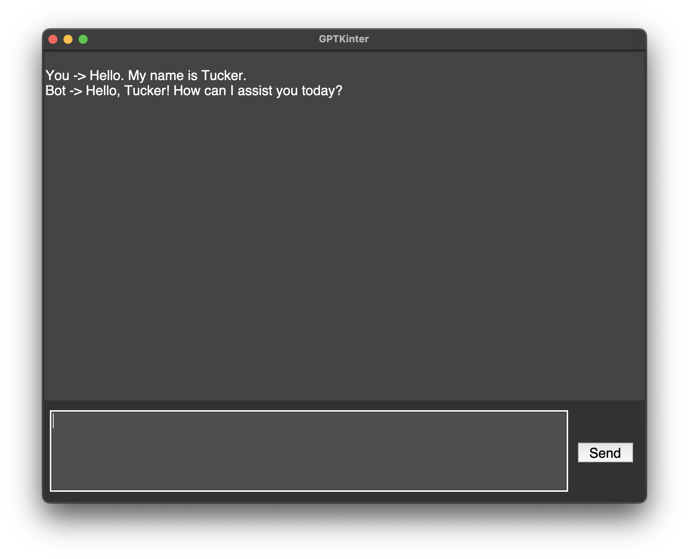

# GPTKinter
## The simplest OpenAI chat interface I could make



Features:
- Chat Box
- Input Field
- Submit Button
- Darkish Mode (always on)


Installing:
1. Clone this repo

2. Create a file named .env in the same directory.

3. Add your OpenAI API Key:
```
OPENAI_API_KEY = "sk_ ..."
```


To Run The Interface:

```python 
python GPTKinter.py 
```


Keep your terminal close by as there is no error handling. 
